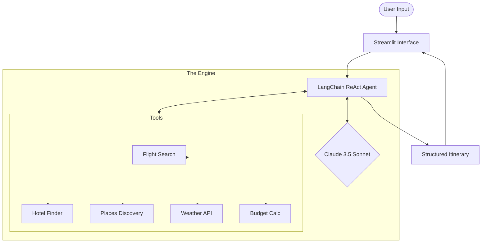

# <p align="center">✈️ Agentic AI Travel Planning Assistant</p>

<p align="center">
  
</p>

<p align="center">
  <a href="#-features"></a>
  <a href="#-tech-stack"></a>
  <a href="https://github.com/pruthvirajtarode/Agentic-AI-Travel-Planner"></a>
</p>

---

### <p align="center">✨ *Transforming the way you plan your adventures with autonomous AI agents.* ✨</p>

> **Agentic AI Travel Planner** is an intelligent, autonomous system that reasons like a travel expert. It uses **LangChain Agents**, **Claude 3.5 Sonnet**, and real-time data to create hyper-personalized itineraries in seconds.

---

## 📖 Table of Contents
<table align="center">
  <tr>
    <td width="33%"><a href="#-features">✨ Features</a></td>
    <td width="33%"><a href="#-tech-stack">🛠️ Tech Stack</a></td>
    <td width="33%"><a href="#-architecture">🏗️ Architecture</a></td>
  </tr>
  <tr>
    <td width="33%"><a href="#-usage-guide">📖 Usage Guide</a></td>
    <td width="33%"><a href="#-installation--setup">🚀 Installation</a></td>
    <td width="33%"><a href="#-screenshots">📸 Screenshots</a></td>
  </tr>
</table>

---

## 🎯 The Problem
Planning a trip is often a stressful maze of switching between 20+ tabs, comparing inconsistent prices, and manually trying to piece together a realistic schedule. 

**The Solution:** Our Agentic AI Assistant handles the heavy lifting—reasoning through budget, weather, and distance to deliver an optimized, ready-to-go plan.

---

## ✨ Features

### 🌍 **Global Destination Support**
*   **AI-Powered Dynamic Data:** Don't see your city in our JSON? No problem. The agent generates realistic data for *any* destination worldwide.
*   **Real-time Intelligence:** Integrates live weather forecasts and optimized routing.

### 🤖 **Agentic Reasoning**
*   **Autonomous Decisions:** The agent doesn't just follow a script; it decides which tools to call based on your unique needs.
*   **Explainable AI:** Every recommendation comes with a "Reasoning" card explaining *why* it fits your trip.

### 🎨 **Premium UI/UX**
*   **Glassmorphism Design:** Modern, frosted-glass interface built with Streamlit.
*   **Interactive Maps:** Visualized travel routes using Folium.
*   **Data Visualization:** Beautiful Plotly charts for weather and budget breakdowns.

---

## 🛠️ Tech Stack

<p align="center">
  
  
  
  
</p>

| Category | Tools |
| :--- | :--- |
| **Orchestration** | LangChain, LangGraph |
| **Brain (LLM)** | Claude 3.5 Sonnet (Anthropic) |
| **Frontend** | Streamlit, Custom CSS |
| **Visualization** | Plotly, Folium |
| **Data** | JSON (Flight/Hotel/Places), Open-Meteo API |

---

## 🏗️ Architecture



---

## 🚀 Installation & Setup

1.  **Clone & Enter**
    ```bash
    git clone https://github.com/pruthvirajtarode/Agentic-AI-Travel-Planner.git
    cd Agentic-AI-Travel-Planner
    ```

2.  **Environment Setup**
    ```bash
    python -m venv .venv
    # Windows
    .venv\Scripts\activate
    # macOS/Linux
    source .venv/bin/activate
    ```

3.  **Install Dependencies**
    ```bash
    pip install -r requirements.txt
    ```

4.  **Configure API Key**
    Create a `.env` file and add:
    ```env
    ANTHROPIC_API_KEY=your_key_here
    ```

---

## ▶️ How to Run

```bash
streamlit run ui/app.py
```
*The app will automatically open at `http://localhost:8501`*

---

## 📸 Screenshots

<details>
<summary><b>Click to expand app preview</b></summary>

### 🌤️ Results Dashboard

*(Replace with actual screenshot for better preview)*

</details>

---

## 🤝 Contributing
Contributions make the open-source community an amazing place to learn and create.
1. Fork the Project
2. Create your Feature Branch (`git checkout -b feature/AmazingFeature`)
3. Commit your Changes (`git commit -m 'Add some AmazingFeature'`)
4. Push to the Branch (`git push origin feature/AmazingFeature`)
5. Open a Pull Request

---

## 📄 License
Education purposes only. 

---

## 👨‍💻 Author
**Pruthviraj Shyamrao Tarode**
[GitHub](https://github.com/pruthvirajtarode) • [LinkedIn](https://www.linkedin.com/in/pruthviraj-tarode/)

---
<p align="center">
  <b>Built with ❤️ using Python • Streamlit • Claude AI • LangChain</b>
</p>
